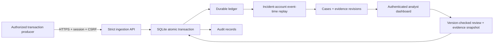

# FraudGraph

A from-scratch, runnable transaction-network investigation system: persistent ingestion API, explainable event-time rules, authenticated analyst dashboard, case reviews, evidence history, user management, and audit records. It uses Python/FastAPI, SQLite WAL and a same-origin HTML/CSS/JavaScript frontend with no frontend build step or third-party CDN.

**Detection effectiveness on real UPI data is unproven.** This is a functioning single-node build with verified behavior, not a validated production fraud classifier. The unchanged detector failed the independent external benchmark: zero alerts across 885,744 IBM AMLSim transactions, including zero of 50 gather-scatter hubs. Read [the validation report](VALIDATION.md), [dataset evidence](DATASET.md), and [security boundaries](SECURITY.md) before considering operational use.

## Start a fresh installation

Python 3.11+ is declared; the complete test run used Python 3.14.2 on macOS arm64. Other Python versions and operating systems have not been exercised. Commands below run from this directory. Create a virtual environment and install the exact verified versions:

```sh
python3 -m venv .venv
.venv/bin/python -m pip install --upgrade pip==26.2.1
.venv/bin/python -m pip install -r requirements-dev.lock
export FRAUDGRAPH_ENV=development
export FRAUDGRAPH_ORIGIN=http://127.0.0.1:8080
export FRAUDGRAPH_DB=data/fraudgraph.sqlite3
.venv/bin/python -m fraudgraph init-admin --username admin
.venv/bin/python -m fraudgraph serve --port 8080
```

Open **http://127.0.0.1:8080**. The bootstrap command prompts for a 14+ character password twice. It refuses to run when an active administrator already exists. There are no packaged default accounts or passwords. Use **User access** to provision analyst, viewer, or ingestor accounts; **Account security** changes your password and revokes all sessions.

`requirements.lock` contains only the 17 runtime packages. `requirements-dev.lock` additionally includes HTTP clients, tests, and audit tools. For a runtime-only installation, install `requirements.lock`; verification and client scripts require the development set. No Node.js dependency is required to serve this application.

The shipped source contains no transaction database. A fresh server starts empty. The development-only **Replay synthetic payments** control sends labelled synthetic fixtures through the real ingestion path. The source selector isolates `synthetic`, `external_synthetic`, and `real` graphs. The public benchmark data is evaluated offline and is not silently seeded as UPI traffic.

## Analyst workflow

1. Choose a data source and filter the case queue by account or status. Metrics and queue refresh every two seconds while visible.
2. Select a case. Inspect the account graph, exact transaction IDs, event times, amounts, flow ratio, and rule explanation. The graph displays up to six source and recipient nodes; the evidence table contains all selected payments.
3. An analyst or administrator records an assessment and note. Viewer accounts can read but cannot change cases. Escalation is an internal state; it does not block payments, freeze an account, or submit a regulatory report.
4. Concurrent edits receive a 409 conflict. New evidence can reopen a dismissed/escalated case, increments its version, and preserves earlier reviews and the exact evidence attached to each decision. Prior changed evidence is available from the revisions endpoint.

There is one institution per installation. Admins, analysts and viewers share its case data. The data-source selector is a provenance partition, not a tenant-access boundary. Admin users can disable accounts, which revokes their sessions. Roles are assigned at provisioning; role editing and password recovery are not implemented.

## Stream transactions

Create an `ingestor` account as an administrator. The client prompts for its password and submits one NDJSON record per request, waiting for a durable acknowledgment before consuming the next. Original transaction IDs must remain stable across retries. Passwords are never command-line arguments.

```sh
.venv/bin/python scripts/generate_synthetic.py --scenario fan_in_fan_out > synthetic.ndjson
.venv/bin/python scripts/ingest.py --url http://127.0.0.1:8080 --username ingest_service --file synthetic.ndjson
```

All generated records are explicitly synthetic. For a real authorized feed, supply records with truthful provenance and bank-issued opaque/tokenized identifiers. `--file -` reads stdin. A transport error or 503 is retried up to three times with the same record. Other failures stop consumption for operator handling. Rerun the unchanged file after interruption: matching records are deduplicated. The client is not a durable broker; upstream retention, offsets, reconciliation and dead-letter handling are the integrating service's responsibility.

An event has the following schema (example is synthetic):

```json
{
  "id": "synthetic:payment:unique-001",
  "occurred_at": 1789900000000,
  "sender": "synthetic:source-001",
  "receiver": "synthetic:hub-001",
  "amount_paise": 12500,
  "provenance": "synthetic"
}
```

`occurred_at` is UTC epoch milliseconds; `amount_paise` is an integer, with 100 paise = ₹1 for supplied UPI-style payments. No floating point money, Boolean integers, self-transfers, unknown fields, or implicit provenance are accepted. IDs/account tokens use letters, digits, `_ . : @ -`, up to 96 characters; use upstream tokenization for incompatible real identifiers. This service does not validate NPCI messages or reconcile actual settlement. IDs are globally unique across provenance partitions: namespace upstream IDs by source.

## API contract

The complete machine-readable request/response schema is [openapi.json](openapi.json). Public interactive API documentation is disabled in the server. Every mutation requires the exact configured `Origin` header. Login returns a cookie and CSRF token; subsequent mutations also require `X-CSRF-Token`. A non-browser client must retain the cookie and send those headers deliberately.

| Endpoint | Authorized roles | Behavior |
| --- | --- | --- |
| `GET /healthz` | Public | Storage liveness only; not an ingestion-lag readiness guarantee |
| `POST /api/login` | Public | Password login, generic failures and throttling |
| `GET /api/me`, `POST /api/logout`, `POST /api/password` | Authenticated | Session details, revocation, own password change |
| `POST /api/transactions/batch` | Admin, ingestor | 1–100 transactions, atomic durable processing |
| `GET /api/metrics`, `/api/config`, `/api/alerts` | Admin, analyst, viewer | Provenance-filtered metrics/configuration/case queue |
| `GET /api/alerts/{id}`, `/api/alerts/{id}/revisions` | Admin, analyst, viewer | Current evidence/reviews; paginated historical evidence |
| `POST /api/alerts/{id}/review` | Admin, analyst | Status, note, expected version |
| `GET/POST /api/users`, `PATCH /api/users/{id}` | Admin | List, provision, activate/deactivate |
| `GET /api/audit` | Admin | Latest 100 events; `offset` pagination |
| `POST /api/demo/{scenario}` | Development admin only | Explicit synthetic scenario replay |

Ingest acknowledgment: `accepted`, `duplicates`, `alert_ids`, measured `processing_ms`, `detector_version`. A successful response is sent after committing ledger, cases and audit together. Lost acknowledgments are recoverable by resubmitting the identical ID/payload. A 409 means conflicting ID reuse, 422 invalid/too-old/future data, 429 explicit work-budget rejection, and 503 unavailable storage. Rejected ingestion is rolled back in full; do not advance the upstream offset for it.

## Event-time and persistence design



Each account is evaluated across trailing inclusive 5-minute, 30-minute and 2-hour windows. At least four distinct inbound counterparties must establish collection before counted payouts occur. At least four recipients, 65–135% payout/inflow value, and 80% recipients absent from the incoming source set are required. “Fresh” here means absent from this motif's source set, **not** a newly opened account or a never-seen recipient. No KYC/account-age signal exists. Scores combine degree, value balance and speed; they are not probabilities. Window candidates are collapsed by highest score (then shortest window on a tie), and overlapping account episodes are merged into cases. Longer windows can receive a higher heuristic score for the same short motif. The evidence always identifies the selected window and actual observed span.

No amount is claimed to be a statutory or reporting threshold. Pure transaction shape cannot distinguish a mule from a legitimate aggregator or trace the ownership of fungible funds.

Late arrivals cause reevaluation of relevant subsequent event endpoints, so receiving payouts before their earlier inflows does not inherently lose the alert. Events beyond a five-minute wall-clock future tolerance or more than 24 hours behind their provenance partition's **previously committed** maximum event timestamp are rejected. Historical initial import is possible when the partition is empty; do not mix historical backfills into a live partition. The offline evaluator has no live-lateness cutoff.

At most 10,000 incident events are considered per affected account in the fetched replay range; endpoint count × incident count must not exceed 2,000,000. Exceeding either limit returns 429 and rolls back the whole batch. This is an explicit availability/detection boundary, not silent sampling. Work is serialized at the SQLite write transaction. Hot accounts and large historical ledgers are not proven performant.

SQLite WAL, foreign keys and FULL synchronous commits provide durable local state. Data files are owner-only. Ledger state is the replay source; no hidden in-memory state is needed after restart. The application does not correct/delete transactions: an amendment/reversal model, retention policy and audited reconciliation process must be designed for a real feed. Audit triggers prevent normal UPDATE/DELETE, but the host/database owner can bypass them.

## Reproduce verification

```sh
.venv/bin/python -m pytest -q --junitxml=evidence/tests.xml
.venv/bin/python scripts/run_adversarial.py
.venv/bin/python scripts/security_probe.py --output evidence/security_live.json
.venv/bin/python scripts/benchmark_http.py
.venv/bin/python scripts/audit_dependencies.py
.venv/bin/python scripts/evaluate_public.py --download --data-dir data/public-reproduction
```

The live probe and benchmark start isolated loopback servers with temporary databases and generated credentials, then clean them up. The public-data script verifies pinned SHA-256s. The dependency fallback uses certificate-verified system curl to query the official PyPI release advisory feed. Feed coverage is limited; zero reported advisories is not a security certification.

## Before a real deployment

This build is deliberately a review system rather than an automated enforcement service. It lacks a bank integration, real-traffic validation, calibrated thresholds, cross-hub/group detection, a durable message broker, high availability, SSO/MFA, managed encryption keys, trusted external audit storage, disaster recovery, retention enforcement and production monitoring. No multi-institution isolation is provided. The short localhost benchmark does not establish safe load limits.

Production mode is the default and requires an HTTPS `FRAUDGRAPH_ORIGIN`; cookies are Secure, HSTS is enabled, and synthetic replay is disabled. Serve the loopback process behind a correctly configured TLS reverse proxy. The supplied CLI ignores forwarded headers. Establish an explicit trusted-proxy/rate-limit strategy before changing this, or all clients may share a peer login limit. Run as a dedicated OS account with a private storage directory and encrypted volumes/backups. Back up via SQLite's online backup API or a stopped/checkpointed database, not a casual copy of the main file while WAL writes are active. Restore and failure drills have not been performed.

Real UPI validation needs permissioned intraday data, independently reviewed outcomes, prospective replay, an untouched holdout, and measured analyst workload. Read the known evasions and false positives before any trial. No legal, regulatory, security-certification or national-network-capacity claim is made.
